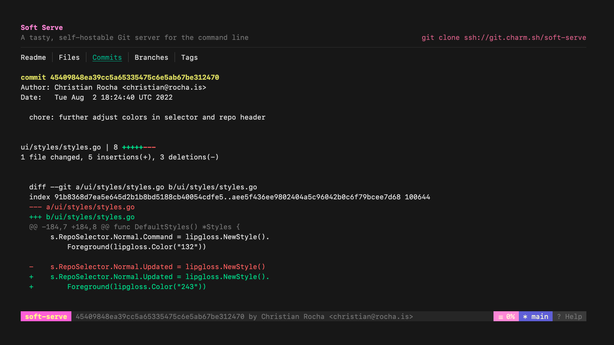

# GoLang Group Project

### Atri Hegde

---

# Framework we are going to use.

BubbleTea is a TUI framework for golang.

---

# Overview

We are going to building a simple TUI for git.

## Why

CLI tools are sexy.
Embrace the terminal.

---

---

---

# Requirements

They should be able to do the following from the TUI

- git add
- git commit
- git fetch (tells us if there are changes upstream.)
- git pull (brings the changes from upstream to local repo)
- git push
- change origin url (upstream url)

---

# Extra details

- Should be able to detect if current directory is a git directory, and if not it should ask if it should initlize a git repository
- We will not be handling any merge conflicts, that is out of scope. Can you think of way to handle this error?

---

# Example of some TUI apps

---

# Soft serve - git server

---

# fm - a TUI file manager

---

# Bonus

If we have extra time, try to implement the `git revert` feature.
